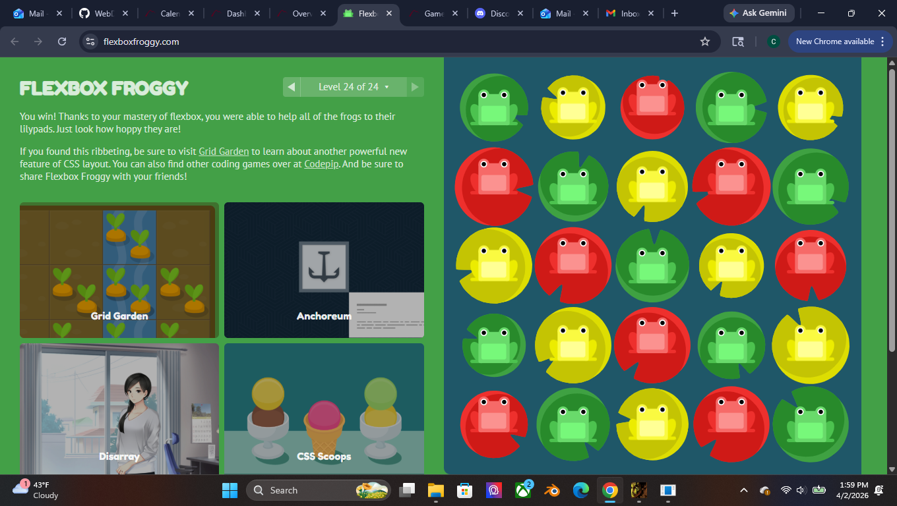
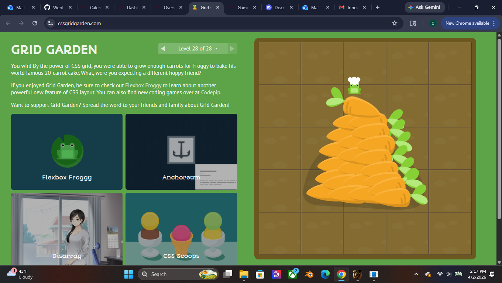

I think this week went very well because not only were the web games a good refresher on how the flex and grid layouts operate, but being able to take inspiration from an existing site to base a component around made it a lot easier to know where I should be placing elements rather than following an idea composed entirely in my head. In general, I feel relaxed and relieved given that I've been able to complete all of my homework in a timely manner and the end of the semester is coming up.

I feel great about using CSS Flexbox, CSS Grid, and component-based thinking as they make the process of work much simpler and easier to gauge in terms of how elements are going to be affected. Like I said earlier, the web games were good refreshers on how Flexbox and Grid can be utilized so I think it will be easier for me to retain the important information about Flexbox and Grid going forward.